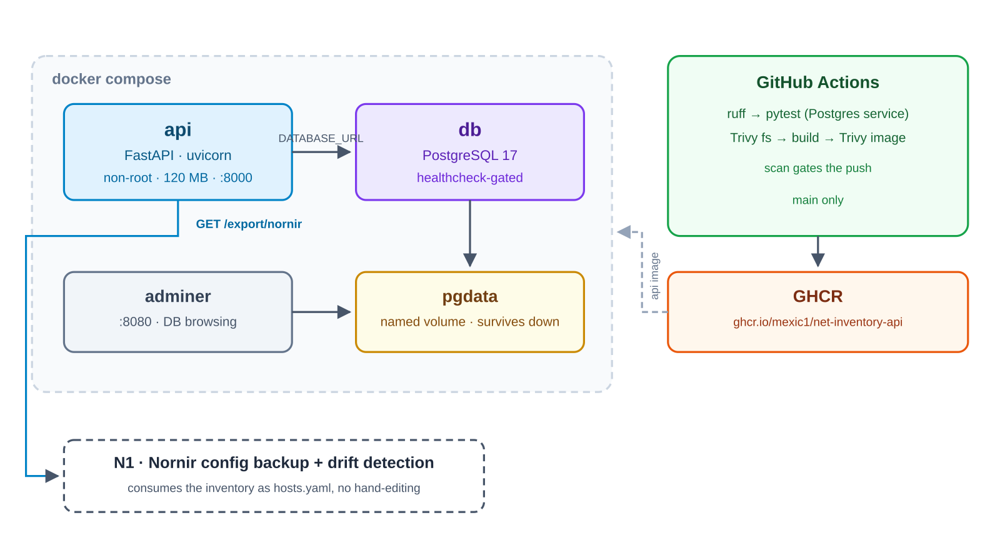

# net-inventory-api

[](https://github.com/Mexic1/Net-inventory-api/actions/workflows/ci.yml)

A REST API over a network device inventory, so automation tooling has one source
of truth to read instead of a hand-maintained `hosts.yaml` that drifts.



## What it demonstrates

- **Containers** — multi-stage build, non-root runtime, `HEALTHCHECK`, 120 MB
  final image (down from 292 MB; see [Design notes](#design-notes)).
- **Compose** — three services with a named volume, and an API that waits for
  PostgreSQL to be *accepting queries* rather than merely started.
- **CI/CD** — ruff, pytest against a real PostgreSQL service container, two
  Trivy scans that gate the push, and publication to GHCR on `main` only.
- **Testing against the real thing** — 21 tests on PostgreSQL 17, not SQLite,
  because the behaviour under test includes unique-violation handling.
- **A contract, not just an endpoint** — `/export/nornir` is consumed downstream
  without hand-editing, and its shape is asserted in tests.

## Stack

| Layer | Tool | Version |
|---|---|---|
| API | FastAPI + uvicorn | 0.141 / 0.53 |
| Validation | Pydantic | 2.13 |
| ORM | SQLAlchemy | 2.0 |
| Driver | psycopg (`[c]` in the image, `[binary]` in tests) | 3.3 |
| Database | PostgreSQL | 17 |
| Runtime | Python on Alpine | 3.12 / 3.24 |
| DB browsing | Adminer | 5 |
| Lint / tests | ruff / pytest | 0.16 / 8.4 |
| CI | GitHub Actions + Trivy | — / 0.36 |

## Quick start

```bash
git clone https://github.com/Mexic1/Net-inventory-api && cd Net-inventory-api
cp .env.example .env          # then set POSTGRES_PASSWORD
docker compose up --build
```

Three commands. Then:

- API docs — <http://127.0.0.1:8000/docs>
- Adminer — <http://127.0.0.1:8080> (server `db`, user `inventory`)

Or skip the build entirely:

```bash
docker pull ghcr.io/mexic1/net-inventory-api:latest
```

## API

| Method | Path | Notes |
|---|---|---|
| `GET` | `/health` | Liveness, used by the container healthcheck |
| `GET` | `/devices` | Sorted by hostname |
| `POST` | `/devices` | `409` on duplicate hostname, `422` on a malformed IP |
| `GET` | `/devices/{id}` | |
| `PUT` | `/devices/{id}` | Full replace |
| `DELETE` | `/devices/{id}` | `204` |
| `GET` | `/export/nornir` | Nornir inventory; `?fmt=yaml` for block YAML |

### The export contract

`GET /export/nornir` returns hostnames as top-level keys, each with a Nornir host
definition. JSON is a subset of YAML 1.2, so the default response redirects
straight into a `hosts.yaml`:

```bash
curl -s localhost:8000/export/nornir > hosts.yaml
```

```yaml
edge-01:
  hostname: 10.0.0.1   # mgmt_ip — the address Nornir connects to
  platform: ios        # derived from vendor, not stored
  groups:
  - router             # from role
  data:
    site: hq
    model: ISR4331
```

`vendor` is normalised to lowercase on write, so `Cisco`, `CISCO` and `cisco`
all map to platform `ios`. Vendors outside the mapping pass through unchanged
rather than being guessed at.

## Development

```bash
make venv        # uv venv on Python 3.12 + dev dependencies
make test-db     # throwaway PostgreSQL on 5433
make test        # 21 tests
make lint
```

`make down` stops the stack and keeps your data; `make clean` also discards the
volume. On Omarchy, Docker is reached through a prompt rather than the
root-equivalent `docker` group — the Makefile detects this and elevates only
when needed. `make sudo-keepalive` prompts once for a working session.

## Design notes

Decisions that were not obvious, and what forced them:

**Alpine, not Debian slim.** The first image was 292 MB against a 150 MB budget.
`python:3.12-slim` costs ~130 MB in base and apt layers before a single
dependency, so no amount of trimming would have been enough.

**`psycopg[c]` in the image, `psycopg[binary]` in tests.** Pure-Python psycopg
locates libpq through `ctypes.util.find_library`, which needs `ldconfig` or
`gcc` — present on a normal host, absent in a minimal Alpine runtime. It passed
locally and crashed in the container. The image compiles the C extension in the
build stage and strips it; tests use the prebuilt wheel so no machine depends on
system libpq.

**Tests run on port 5433.** The suite drops and recreates tables. Pointed at the
compose database, it would quietly destroy development data.

**The dependency scanner gets a pinned file.** `requirements.txt` holds version
ranges, and Trivy's pip parser only reads `name==version` — so the fs scan
originally reported *no targets* and passed without checking anything. CI now
materialises `requirements.lock` under a name the scanner parses.

**Scan before push.** The image is built, loaded and scanned; only then does
`main` publish it. Pull requests build and scan but never publish.
